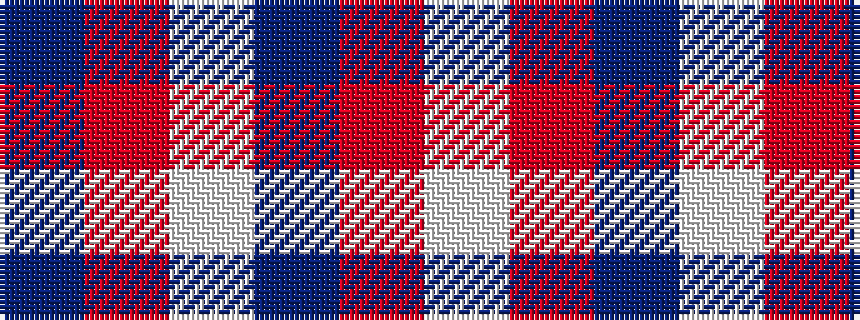

BRWBRW

It is a 6 stripe tartan.

<figure class="pat-woven">

<figcaption>idealised sample</figcaption>
</figure>

## Colour Sequence



## Tartans with this colour sequence

| Tartans |
|---------------|
| [Little's (Corporate)](/variants/s6/db1o8w1db4r8w1~x6/)|
||
