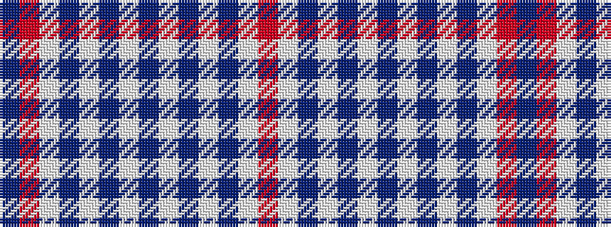

BRWBWBWBWBWBWR

It is a 14 stripe tartan.

<figure class="pat-woven">

<figcaption>idealised sample</figcaption>
</figure>

## Colour Sequence



## Tartans with this colour sequence

| Tartans |
|---------------|
| [Jubilation](/setts/s14/r11w13db30w13db11w2db8w2db11w13db30w13r11db2~x2/)|
||
