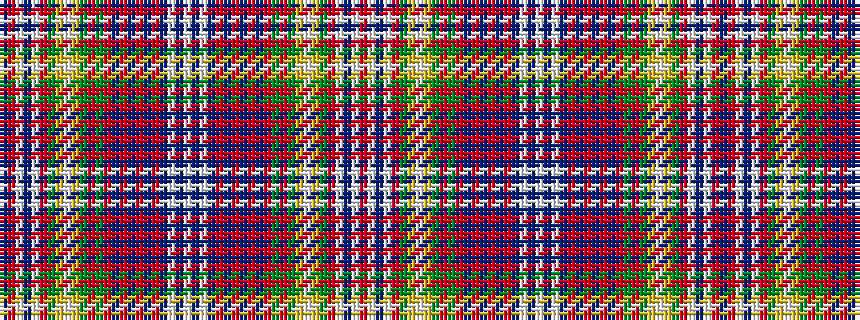

BRWBWRGYWYGRGRBRBRBRBWBWBWBRBRBRBRGRGYWYGRWBWR

It is a 46 stripe tartan.

<figure class="pat-woven">

<figcaption>idealised sample</figcaption>
</figure>

## Colour Sequence



## Tartans with this colour sequence

| Tartans |
|---------------|
| [Hebrides North Uist](/setts/s46/db5r3w2db1w2r3g9ly2w1ly2g9r1g1r27db1r1db1r27db1r1db9w1db1w4~x2/)|
||
