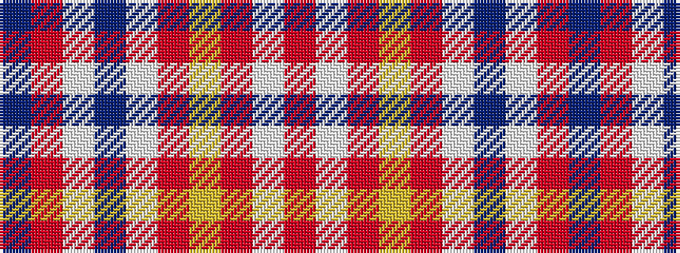

BRWBWRYRWR

It is a 10 stripe tartan.

<figure class="pat-woven">

<figcaption>idealised sample</figcaption>
</figure>

## Colour Sequence



## Tartans with this colour sequence

| Tartans |
|---------------|
| [Glenfinnan (Clan?)](/setts/s10/n28r26w2n5w2r26lg28r5w2r5~x2/)|
||
