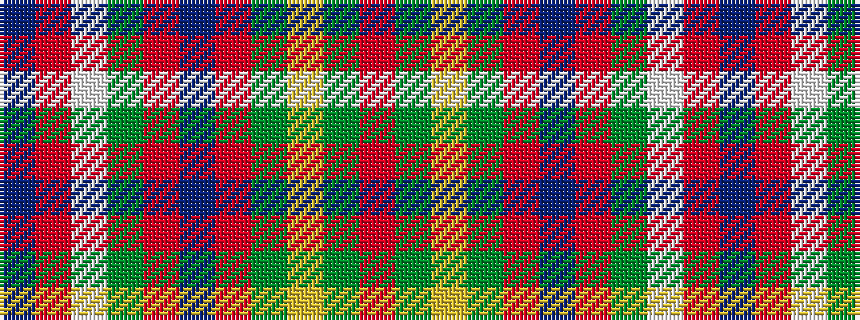

BRWGRBRGYGR

It is a 11 stripe tartan.

<figure class="pat-woven">

<figcaption>idealised sample</figcaption>
</figure>

## Colour Sequence



## Tartans with this colour sequence

| Tartans |
|---------------|
| [Loch Creran](/variants/s11/r5g9ly2g9r5b9r28g3lt2r4b2~x2/)|
||
| [Loch Creran (District)](/variants/s11/r6dg8ly2dg8r6dt8r29dg3lb2r5dt3~x2/)|
||
