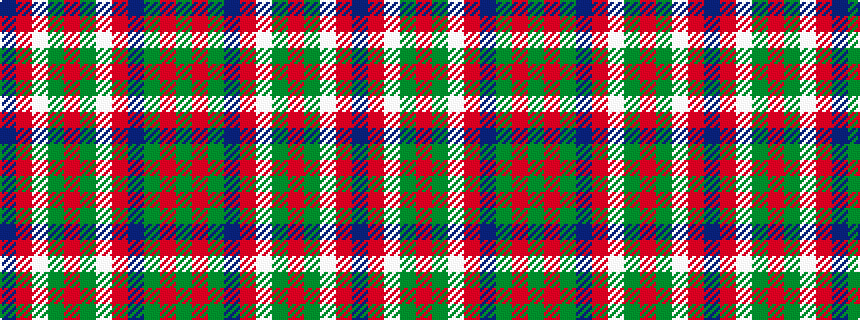

BRWGRGWRBGRG

It is a 12 stripe tartan.

<figure class="pat-woven">

<figcaption>idealised sample</figcaption>
</figure>

## Colour Sequence



## Tartans with this colour sequence

| Tartans |
|---------------|
| [McGirr, David (Letterkenny)](/variants/s12/dg13r1dg13t6r1w6dg13r1dg13w6r1t6~x2/)|
||
