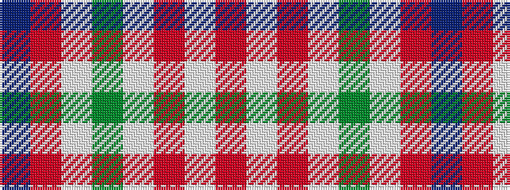

BRWGWRWR

It is a 8 stripe tartan.

<figure class="pat-woven">

<figcaption>idealised sample</figcaption>
</figure>

## Colour Sequence



## Tartans with this colour sequence

| Tartans |
|---------------|
| [Chaudhri (Name)](/variants/s8/dp13r8lb5dg24lb5r10lb5r10~x2/)|
||
