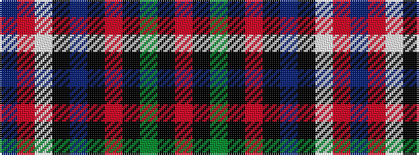

BRWKBKRKGKR

It is a 11 stripe tartan.

<figure class="pat-woven">

<figcaption>idealised sample</figcaption>
</figure>

## Colour Sequence



## Tartans with this colour sequence

| Tartans |
|---------------|
| [Kildare County, Crest Range](/setts/s11/o40k5y48k5r20k5t14k10w4r28t10/)|
||
