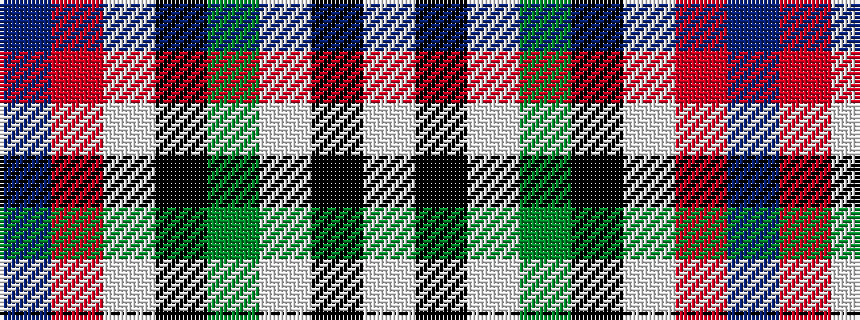

BRWKGWKW

It is a 8 stripe tartan.

<figure class="pat-woven">

<figcaption>idealised sample</figcaption>
</figure>

## Colour Sequence



## Tartans with this colour sequence

| Tartans |
|---------------|
| [MacDuff Dress](/variants/s8/w4k1w4dg6k4w5r1t2~x2/)|
||
| [MacDuff, dress](/variants/s8/w4k1w4g6k4w5r1t2~x2/)|
||
