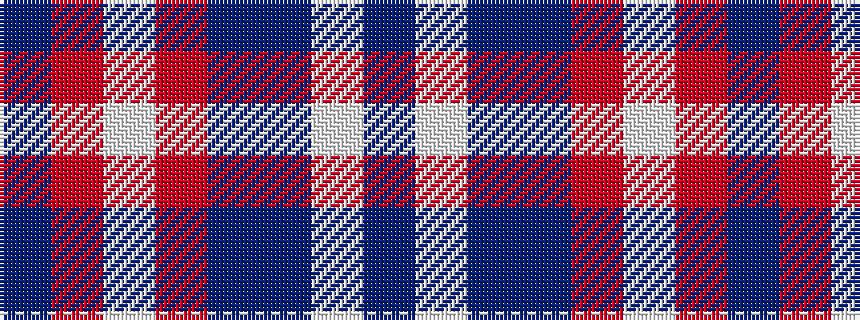

BRWRBBWB

It is a 8 stripe tartan.

<figure class="pat-woven">

<figcaption>idealised sample</figcaption>
</figure>

## Colour Sequence



## Tartans with this colour sequence

| Tartans |
|---------------|
| [Longniddry Lavender (Dance)](/setts/s8/db42o2lb2o2db5p12lb32db4~x2/)|
||
