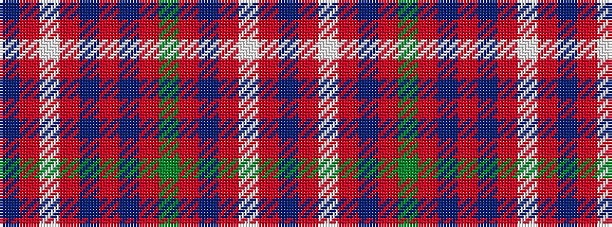

BRWRBRBRGRBRWRB

It is a 15 stripe tartan.

<figure class="pat-woven">

<figcaption>idealised sample</figcaption>
</figure>

## Colour Sequence



## Tartans with this colour sequence

| Tartans |
|---------------|
| [Fitzgerald](/setts/s15/db3r4w3r15db4r4db13r4g13r4db4r15w3r4db3~x2/)|
||
