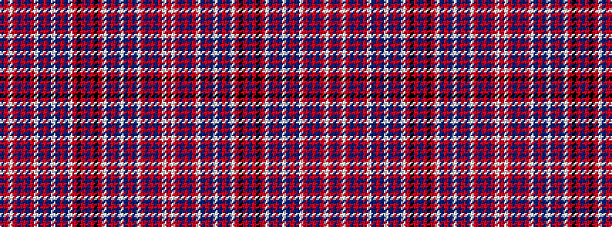

BRWRBRBRWBRBWBRBWRKRBRKRWBRBWBRBWRBRBRWR

It is a 40 stripe tartan.

<figure class="pat-woven">

<figcaption>idealised sample</figcaption>
</figure>

## Colour Sequence



## Tartans with this colour sequence

This pattern is a design lineage: every tartan below shares one colour order, whatever its owner —
near-identical designs are grouped, the largest lineage first (#112: the pattern is a tartan's
second parent, beside its family or clan).

<table class="sett-table">
<tbody>
<tr><td><a href="/variants/s40/db1r1w2r12db1r2db1r12w1db1r1db1lb1db1r1db1w1r6k2r7dr4r7k2r6w1db1r1db1lb1db1r1db1w1r12db1r2db1r12w2r1~x2~db1406275-dr1305012/">Takla Makan (Red)</a></td></tr>
<tr><td class="sett-swatch"></td></tr>
</tbody>
</table>

