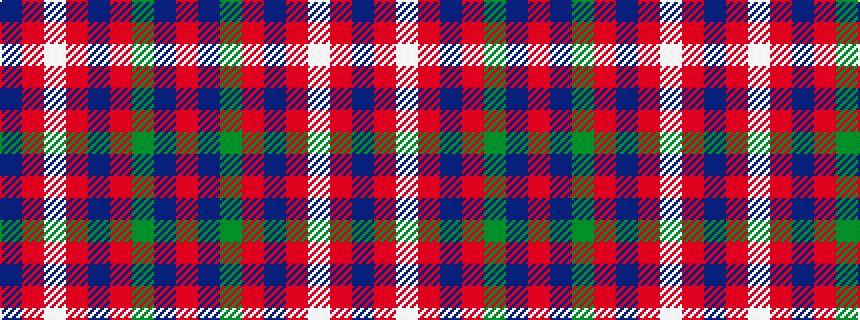

BRWRBRGBR

It is a 9 stripe tartan.

<figure class="pat-woven">

<figcaption>idealised sample</figcaption>
</figure>

## Colour Sequence



## Tartans with this colour sequence

| Tartans |
|---------------|
| [Willsher Wedding (Personal)](/setts/s9/n8o4lb2o4n1o12g9n24r4~x2/)|
||
| [Willsher Wedding (Personal)](/setts/s9/do8o4w2o4do1o12dg9do24r4~x2/)|
||
