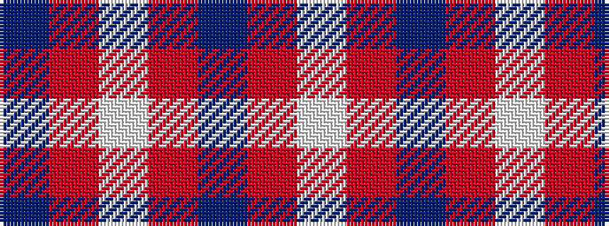

BRWRBRW

It is a 7 stripe tartan.

<figure class="pat-woven">

<figcaption>idealised sample</figcaption>
</figure>

## Colour Sequence



## Tartans with this colour sequence

| Tartans |
|---------------|
| [Shiel, Claret (Dance)](/setts/s7/w8ri5dp10r24w30ri2db2~x2/)|
||
