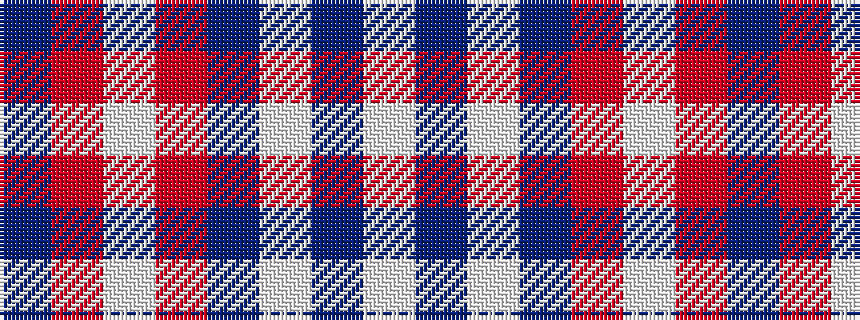

BRWRBWBW

It is a 8 stripe tartan.

<figure class="pat-woven">

<figcaption>idealised sample</figcaption>
</figure>

## Colour Sequence



## Tartans with this colour sequence

| Tartans |
|---------------|
| [Baker](/setts/s8/db28o3w1o3db4w2dp1w5~x4/)|
||
| [Baker](/setts/s8/db28o3w1o3db4w2p1w5~x4/)|
||
