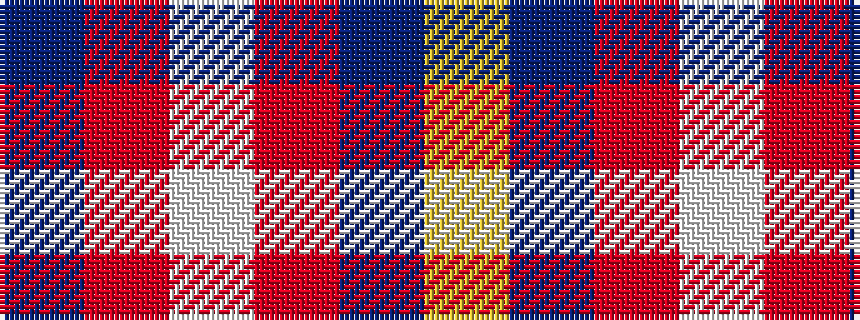

BRWRBY

It is a 6 stripe tartan.

<figure class="pat-woven">

<figcaption>idealised sample</figcaption>
</figure>

## Colour Sequence



## Tartans with this colour sequence

| Tartans |
|---------------|
| [McKerrell of Hillhouse Dress](/variants/s6/t48o28w4o28t48ly3~x2/)|
||
| [Unidentified Lindley](/variants/s6/b6o6w1o6b6ly1~x8/)|
||
