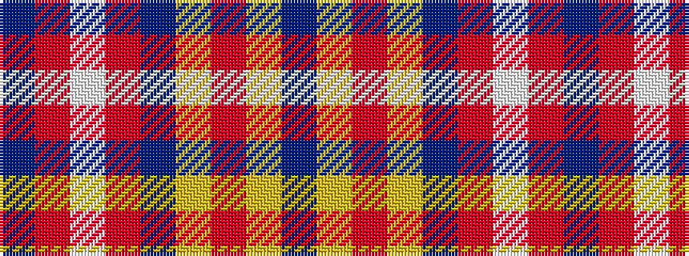

BRWRBYRYB

It is a 9 stripe tartan.

<figure class="pat-woven">

<figcaption>idealised sample</figcaption>
</figure>

## Colour Sequence



## Tartans with this colour sequence

| Tartans |
|---------------|
| [Millar (Kirkcaldy) (Personal)](/variants/s9/dt5r2lp2r2dt5ly1r1ly1dt5~x8/)|
||
