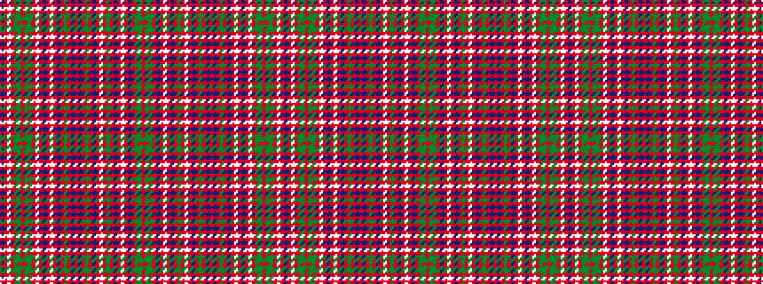

BRWRGGRGGRWRBRWRBRGRBRBRGRBRWRGRBRWRBRGGR

It is a 41 stripe tartan.

<figure class="pat-woven">

<figcaption>idealised sample</figcaption>
</figure>

## Colour Sequence



## Tartans with this colour sequence

| Tartans |
|---------------|
| [MacAlister](/variants/s41/r16g2dg12r4t4r4w2r4t4r4dg12r2w1r24t1r2dg44r2t2r64t2r2dg44r2t2r22w2r2db16r2w2r10dg12g2r8g2dg12r3w2r2db10~x2/)|
||
| [MacAlister (Logan 1831)](/variants/s41/r32g2dg12r4t4r4w2r4t4r4dg12r2w2r24t2r2dg44r2t2r64t2r2dg44r2t2r22w2r2db16r2w2r10dg12g2r8g2dg12r3w2r2db10~x2/)|
||
