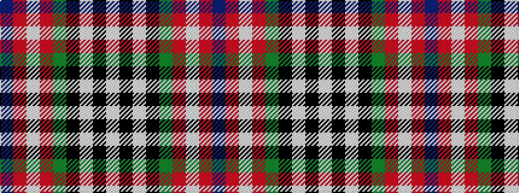

BRWRGKWKW

It is a 9 stripe tartan.

<figure class="pat-woven">

<figcaption>idealised sample</figcaption>
</figure>

## Colour Sequence



## Tartans with this colour sequence

| Tartans |
|---------------|
| [Unidentified #43](/variants/s9/db48r10w2r10dg17k3w17k3w34~x2/)|
||
| [Unidentified 18](/variants/s9/db48r10w2r10g17k3w17k3w34~x2/)|
||
