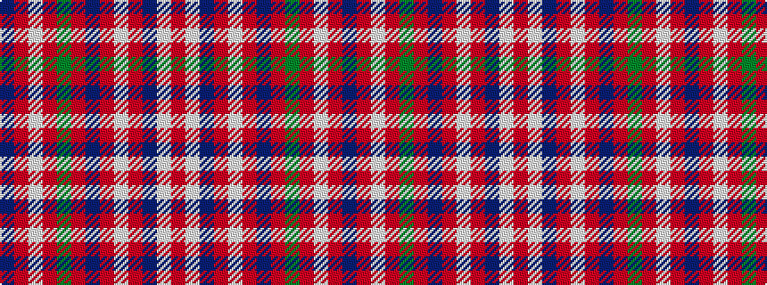

BRWRGRBRWRBWR

It is a 13 stripe tartan.

<figure class="pat-woven">

<figcaption>idealised sample</figcaption>
</figure>

## Colour Sequence



## Tartans with this colour sequence

This pattern is a design lineage: every tartan below shares one colour order, whatever its owner —
near-identical designs are grouped, the largest lineage first (#112: the pattern is a tartan's
second parent, beside its family or clan).

<table class="sett-table">
<tbody>
<tr><td><a href="/variants/s13/r4w1db1r32w2r2db12r2g16r4w1r4db2/">MacGillivray</a></td></tr>
<tr><td class="sett-swatch"></td></tr>
<tr><td><a href="/setts/r4lb1db1r32lb2r2db12r2g16r4lb1r4db2/">MacGillivray</a></td></tr>
<tr><td class="sett-swatch"></td></tr>
<tr class="cluster-sep"><td></td></tr>
<tr><td><a href="/variants/s13/r6lb1dt1r57lb2r2dt23r4g30r6lb1r6dt2~x2/">MacGillivray</a></td></tr>
<tr><td class="sett-swatch"></td></tr>
</tbody>
</table>

