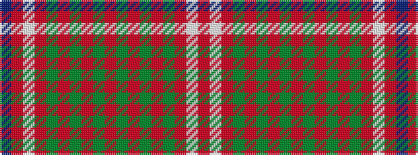

BRWRGRGRGRGRGRGRWR

It is a 18 stripe tartan.

<figure class="pat-woven">

<figcaption>idealised sample</figcaption>
</figure>

## Colour Sequence



## Tartans with this colour sequence

| Tartans |
|---------------|
| [Harkness Dress](/setts/s18/b10r2w2r16g6r1g2r1g3r6~x4/)|
||
