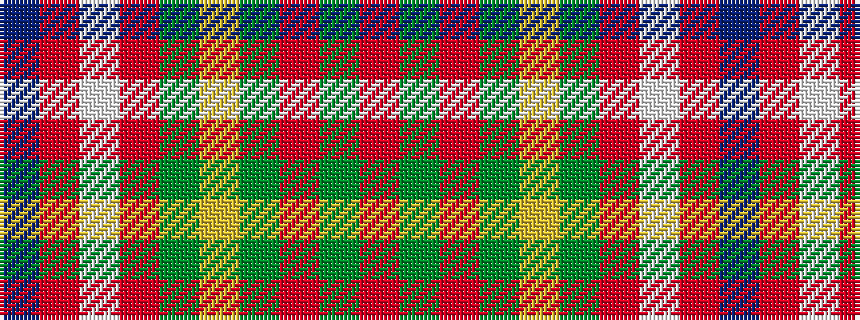

BRWRGYGRGR

It is a 10 stripe tartan.

<figure class="pat-woven">

<figcaption>idealised sample</figcaption>
</figure>

## Colour Sequence



## Tartans with this colour sequence

| Tartans |
|---------------|
| [Connecticut, State of](/variants/s10/b20o2w1o5g8ly1g2r1g8o8~x4/)|
||
