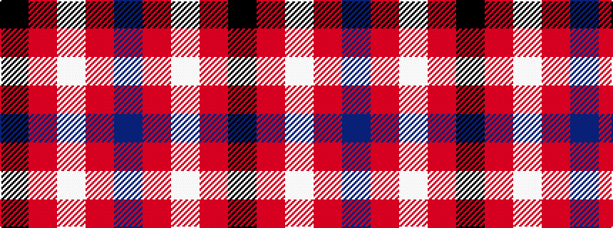

BRWRK

It is a 5 stripe tartan.

<figure class="pat-woven">

<figcaption>idealised sample</figcaption>
</figure>

## Colour Sequence



## Tartans with this colour sequence

| Tartans |
|---------------|
| [Laing of Archiestown](/variants/s5/db8r1w1r1k1~x8/)|
||
| [Laing of Archiestown](/variants/s5/db19r2w2r2k2~x4/)|
||
