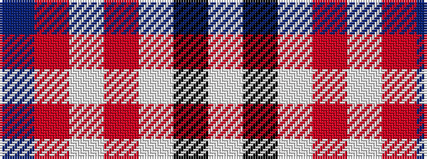

BRWRWKW

It is a 7 stripe tartan.

<figure class="pat-woven">

<figcaption>idealised sample</figcaption>
</figure>

## Colour Sequence



## Tartans with this colour sequence

| Tartans |
|---------------|
| [Arduaine, Red (Dance)](/setts/s7/w5k2w30r24w3r8dt3~x2/)|
||
