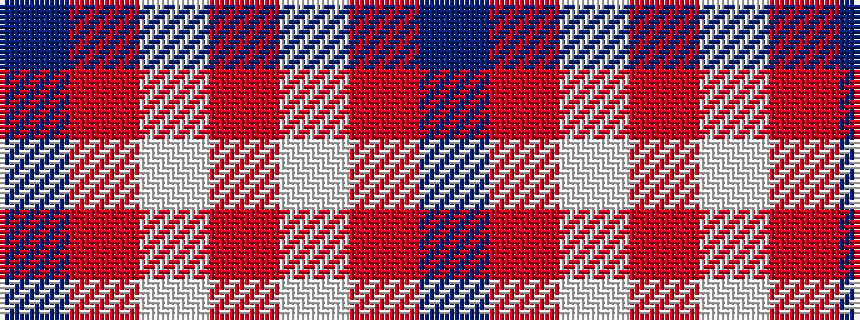

BRWRWRB

It is a 7 stripe tartan.

<figure class="pat-woven">

<figcaption>idealised sample</figcaption>
</figure>

## Colour Sequence



## Tartans with this colour sequence

| Tartans |
|---------------|
| [St Giles Check Tartan Tartan Number: 387. Earliest known date: 1984 St Giles Church is in the Royal Mile, Edinburgh See products available Copyright © Blair Urquhart, Comrie, 2015](/setts/s7/db3o1w1o25w1o1dp3~x2/)|
||
| [St. Giles Check (Corporate)](/setts/s7/db3o1w1o25w1o1dp3~x4/)|
||
