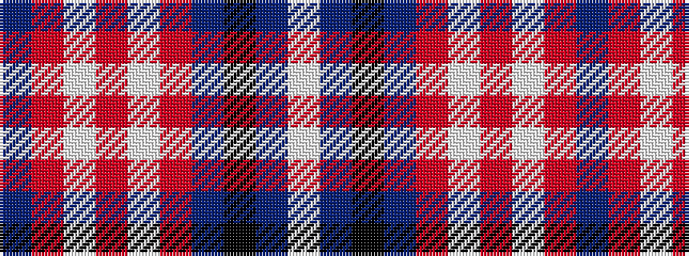

BRWRWRBKBW

It is a 10 stripe tartan.

<figure class="pat-woven">

<figcaption>idealised sample</figcaption>
</figure>

## Colour Sequence



## Tartans with this colour sequence

| Tartans |
|---------------|
| [GYL family (Personal)](/setts/s10/db28r3w3r3w3r3db28k12b38w8/)|
||
