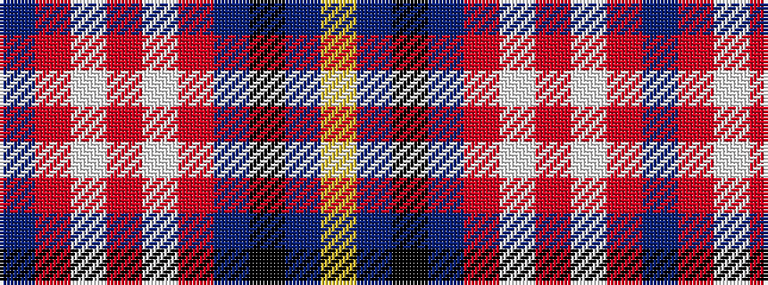

BRWRWRBKBY

It is a 10 stripe tartan.

<figure class="pat-woven">

<figcaption>idealised sample</figcaption>
</figure>

## Colour Sequence



## Tartans with this colour sequence

| Tartans |
|---------------|
| [GYL (Personal)](/variants/s10/db28r3w3r3w3r3db14k12t38ly8/)|
||
| [Lopatinsky (Personal)](/variants/s10/db24r6w6r6w6r6db25k12b36ly6/)|
||
