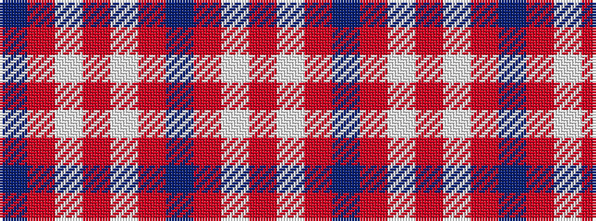

BRWRWRBRWR

It is a 10 stripe tartan.

<figure class="pat-woven">

<figcaption>idealised sample</figcaption>
</figure>

## Colour Sequence



## Tartans with this colour sequence

| Tartans |
|---------------|
| [Miyuki #2](/setts/s10/r40w1r1dt8r1w1r6w1r1dt8~x2/)|
||
