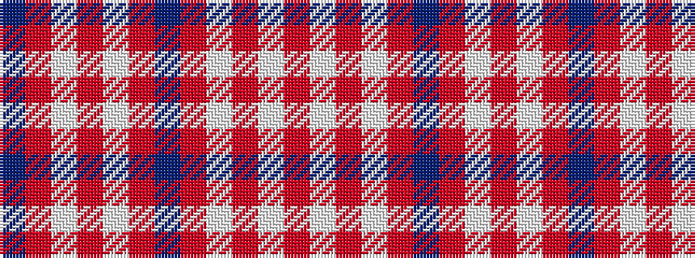

BRWRWRBRWRWR

It is a 12 stripe tartan.

<figure class="pat-woven">

<figcaption>idealised sample</figcaption>
</figure>

## Colour Sequence



## Tartans with this colour sequence

| Tartans |
|---------------|
| [St. Giles Check](/variants/s12/db3o1w1o25w1o1dp3~x4/)|
||
