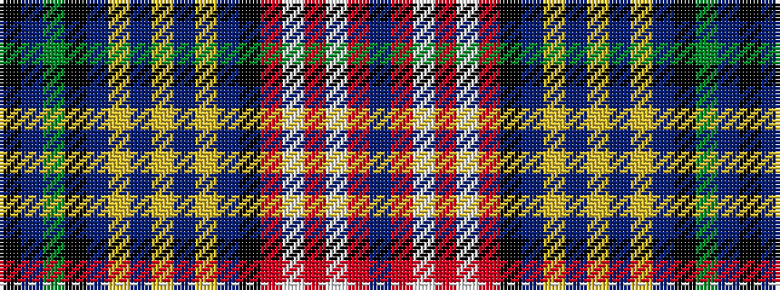

BRWRWRKBYBYBYBKGBK

It is a 18 stripe tartan.

<figure class="pat-woven">

<figcaption>idealised sample</figcaption>
</figure>

## Colour Sequence



## Tartans with this colour sequence

| Tartans |
|---------------|
| [Ruairidh (Personal)](/setts/s18/n17r41w5r5w5r41k17n17lo36t6lo6t6lo36n17k17dy36n17k7/)|
||
