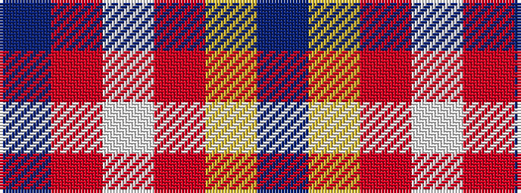

BRWRYB

It is a 6 stripe tartan.

<figure class="pat-woven">

<figcaption>idealised sample</figcaption>
</figure>

## Colour Sequence



## Tartans with this colour sequence

| Tartans |
|---------------|
| [Auchtermuchty Tartan Army](/variants/s6/db80r8w1r8ly20db15~x2/)|
||
| [Auchtermuchty Tartan Army (Corp)](/variants/s6/db80r7w1r7ly20db15~x2/)|
||
