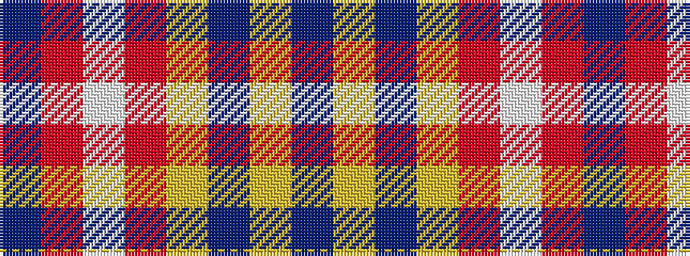

BRWRYBYB

It is a 8 stripe tartan.

<figure class="pat-woven">

<figcaption>idealised sample</figcaption>
</figure>

## Colour Sequence



## Tartans with this colour sequence

| Tartans |
|---------------|
| [Duke of York (Royal)](/setts/s8/db61r6w2r8lo2db3lo2db15~x2/)|
||
| [Inverness, Duke of York](/setts/s8/db122r11w4r15ly4db6ly4db30/)|
||
