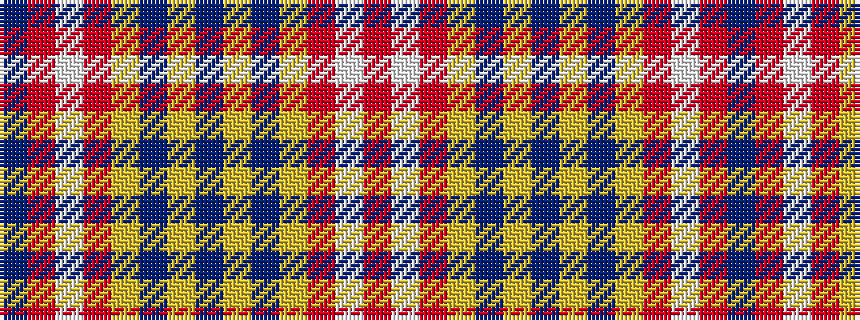

BRWRYBYBYBYRWR

It is a 14 stripe tartan.

<figure class="pat-woven">

<figcaption>idealised sample</figcaption>
</figure>

## Colour Sequence



## Tartans with this colour sequence

| Tartans |
|---------------|
| [Inverness Hunting](/setts/s14/db61r6w2r8lo2db3lo2db15~x2/)|
||
