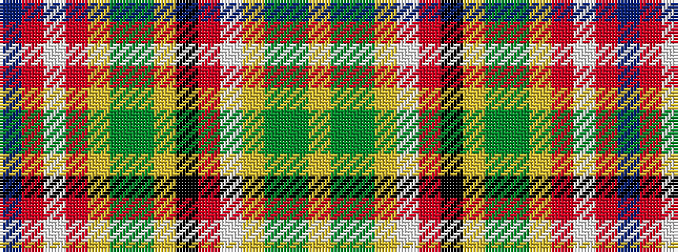

BRWRYGGYKRWYGGY

It is a 15 stripe tartan.

<figure class="pat-woven">

<figcaption>idealised sample</figcaption>
</figure>

## Colour Sequence



## Tartans with this colour sequence

| Tartans |
|---------------|
| [Contrecoeur Corporate Tartan Tartan Number: 2294. Earliest known date: 1992 Small township in southern Quebec. Tartan designed by French Canadian Madeleine Asselin. See products available Copyright © Blair Urquhart, Comrie, 2015](/setts/s15/ly10dy1g2ly2w2r1k2ly2g2dy1ly10r7w3r13db5~x2/)|
||
