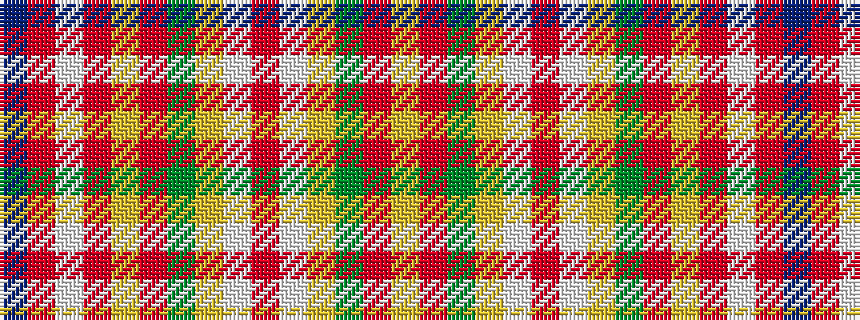

BRWRYRGYWRWYGRY

It is a 15 stripe tartan.

<figure class="pat-woven">

<figcaption>idealised sample</figcaption>
</figure>

## Colour Sequence



## Tartans with this colour sequence

| Tartans |
|---------------|
| [Contrecoeur](/setts/s15/ly10o1g2ly2lb2m1lb2ly2g2o1ly10m7w3m13db5~x2/)|
||
