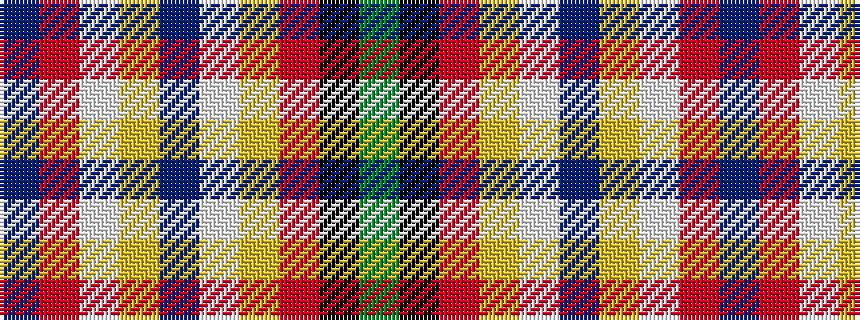

BRWYBWYRKG

It is a 10 stripe tartan.

<figure class="pat-woven">

<figcaption>idealised sample</figcaption>
</figure>

## Colour Sequence



## Tartans with this colour sequence

| Tartans |
|---------------|
| [McMuldroch (2014)](/setts/s10/g19k18r18ly2w2dp2ly2w2r8dp3~x2/)|
||
