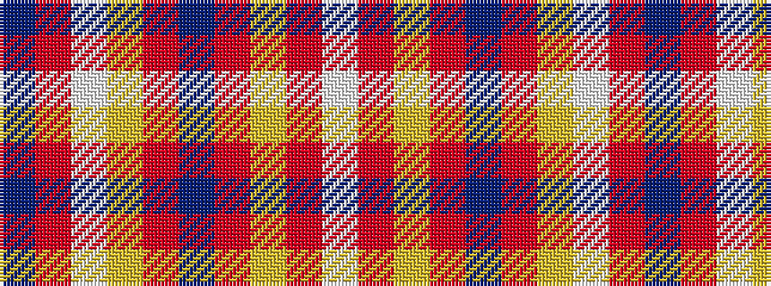

BRWYRBRYRW

It is a 10 stripe tartan.

<figure class="pat-woven">

<figcaption>idealised sample</figcaption>
</figure>

## Colour Sequence



## Tartans with this colour sequence

| Tartans |
|---------------|
| [Glenburnie School](/setts/s10/n22r2w1lo3r1n6r22lo3r1w10~x4/)|
||
