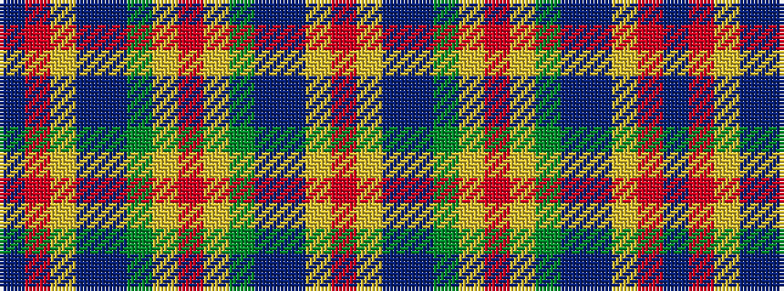

BRYBBGYRYGBBYR

It is a 14 stripe tartan.

<figure class="pat-woven">

<figcaption>idealised sample</figcaption>
</figure>

## Colour Sequence



## Tartans with this colour sequence

| Tartans |
|---------------|
| [Hawaiian](/variants/s14/t4r1ly1t12do4y10ly1r3~x4/)|
||
