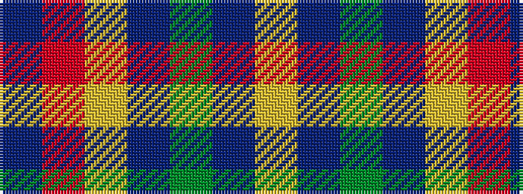

BRYBGBY

It is a 7 stripe tartan.

<figure class="pat-woven">

<figcaption>idealised sample</figcaption>
</figure>

## Colour Sequence



## Tartans with this colour sequence

| Tartans |
|---------------|
| [Lachance (Commemorative)](/setts/s7/n50o50ly1db27dg18do9ly4~x2/)|
||
