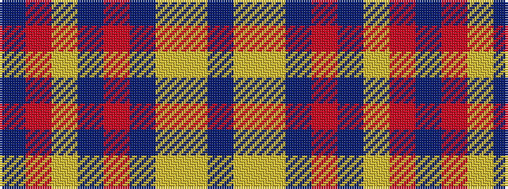

BRYBRBYYB

It is a 9 stripe tartan.

<figure class="pat-woven">

<figcaption>idealised sample</figcaption>
</figure>

## Colour Sequence



## Tartans with this colour sequence

| Tartans |
|---------------|
| [Toorak Chapler](/variants/s9/do3o1lr1do1o3do3lr3ly6n1~x6/)|
||
