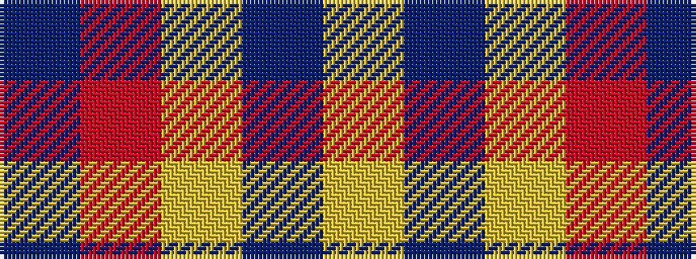

BRYBY

It is a 5 stripe tartan.

<figure class="pat-woven">

<figcaption>idealised sample</figcaption>
</figure>

## Colour Sequence



## Tartans with this colour sequence

| Tartans |
|---------------|
| [Lytley alias Parsons Hunting (Personal)](/setts/s5/db10r1ly1db3ly2~x5/)|
||
