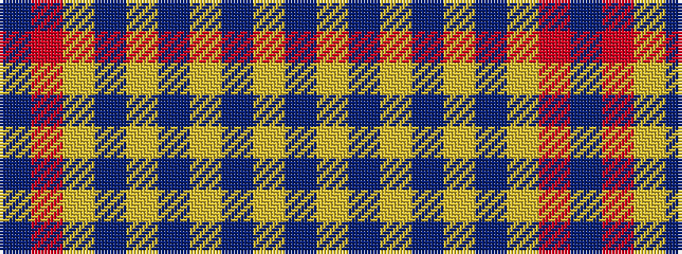

BRYBYBYBYB

It is a 10 stripe tartan.

<figure class="pat-woven">

<figcaption>idealised sample</figcaption>
</figure>

## Colour Sequence



## Tartans with this colour sequence

| Tartans |
|---------------|
| [Brook (Estate Check)](/variants/s10/n4lr4do4lr4n4lr4do4lr4r1n4~x4/)|
||
