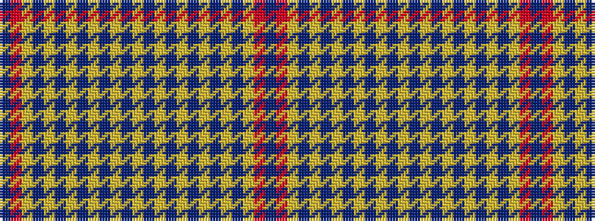

BRYBYBYBYBYBYBYBYBYBYBYRB

It is a 25 stripe tartan.

<figure class="pat-woven">

<figcaption>idealised sample</figcaption>
</figure>

## Colour Sequence



## Tartans with this colour sequence

| Tartans |
|---------------|
| [Allen hunting](/setts/s25/b22r1lo4b4lo1b1lo1b1lo1b1lo1b1lo1b1lo1b1lo1b1lo1b1lo1b1lo9o24db2~x4/)|
||
