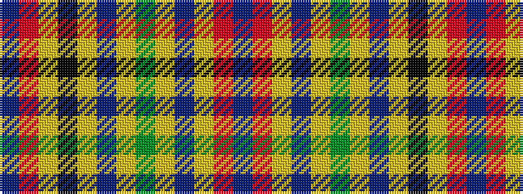

BRYBYGYBYKYRB

It is a 13 stripe tartan.

<figure class="pat-woven">

<figcaption>idealised sample</figcaption>
</figure>

## Colour Sequence



## Tartans with this colour sequence

| Tartans |
|---------------|
| [Neumann - GPS German Pipe Smokers](/setts/s13/do2r3lo1k2lo1dp16lo1dg32lo1do2lo1r1do1~x2/)|
||
