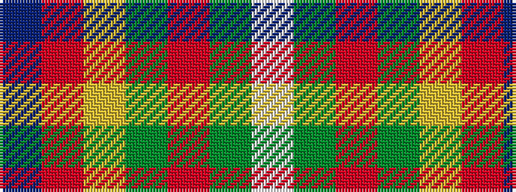

BRYGRGW

It is a 7 stripe tartan.

<figure class="pat-woven">

<figcaption>idealised sample</figcaption>
</figure>

## Colour Sequence



## Tartans with this colour sequence

| Tartans |
|---------------|
| [Elystan Glodrydd (Name)](/variants/s7/w3g24r13gi4lo11r8db2~x2/)|
||
