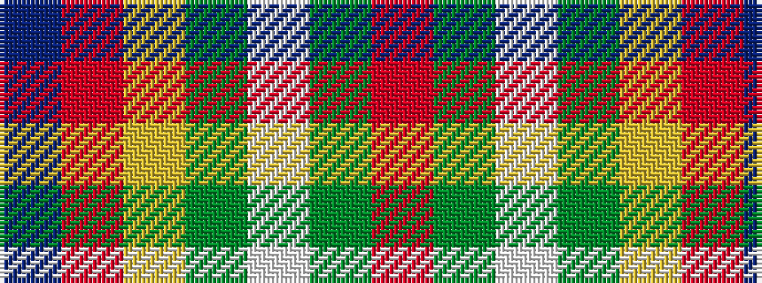

BRYGWGR

It is a 7 stripe tartan.

<figure class="pat-woven">

<figcaption>idealised sample</figcaption>
</figure>

## Colour Sequence



## Tartans with this colour sequence

| Tartans |
|---------------|
| [George Watson's College](/setts/s7/r1g4w1g4ly1r8t1~x6/)|
||
