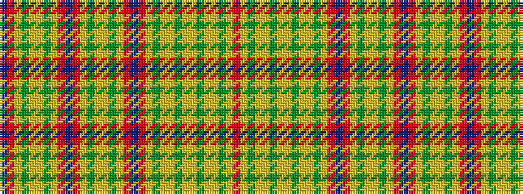

BRYGYYGYRBRYGYYGYRBRYGYYGYYGYYGYR

It is a 33 stripe tartan.

<figure class="pat-woven">

<figcaption>idealised sample</figcaption>
</figure>

## Colour Sequence



## Tartans with this colour sequence

| Tartans |
|---------------|
| [Equorian Olympic Commemorative Tartan](/variants/s33/db2o1lo1dg6lr3lo3dy6lo1o1db2o1lo1dg6lr3lo3dy6lo1o1db2o1lo1dg6lr3lo3dy6lo3lr3dg6lr3lo3dy6lo1o1/)|
||
