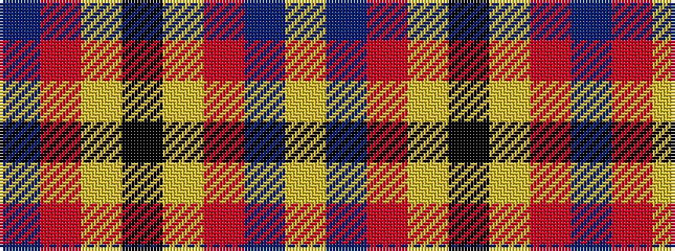

BRYKYRBY

It is a 8 stripe tartan.

<figure class="pat-woven">

<figcaption>idealised sample</figcaption>
</figure>

## Colour Sequence



## Tartans with this colour sequence

| Tartans |
|---------------|
| [Pittsburgh St Andrew's Society](/variants/s8/t1r1lo1k15lo15r1t1lo1~x4/)|
||
