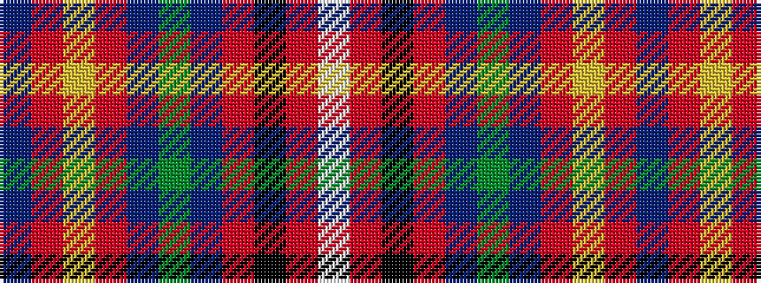

BRYRBGBRKRW

It is a 11 stripe tartan.

<figure class="pat-woven">

<figcaption>idealised sample</figcaption>
</figure>

## Colour Sequence



## Tartans with this colour sequence

| Tartans |
|---------------|
| [Wilson's, No 128](/setts/s11/t4r3ly2r9t3g24t3r9k3r3w2~x2/)|
||
