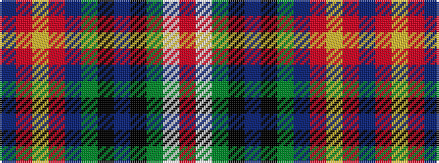

BRYRBGKBKGWR

It is a 12 stripe tartan.

<figure class="pat-woven">

<figcaption>idealised sample</figcaption>
</figure>

## Colour Sequence



## Tartans with this colour sequence

| Tartans |
|---------------|
| [Heritage Sequane](/setts/s12/db5r2lo7r2db42g28k5db10k15g5w3r3/)|
||
| [Héritage Séquane](/setts/s12/db5r2ly7r2db42dg28k5db10k15dg5w3r3/)|
||
